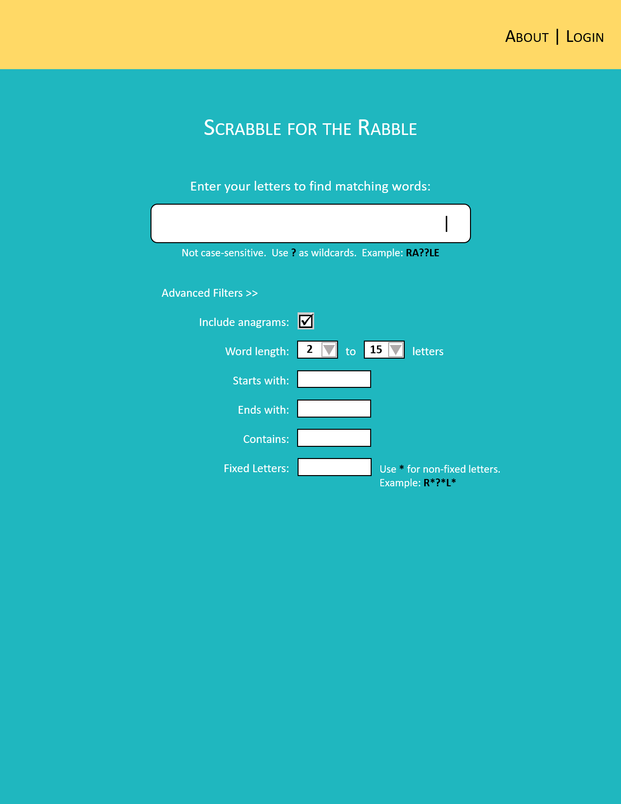
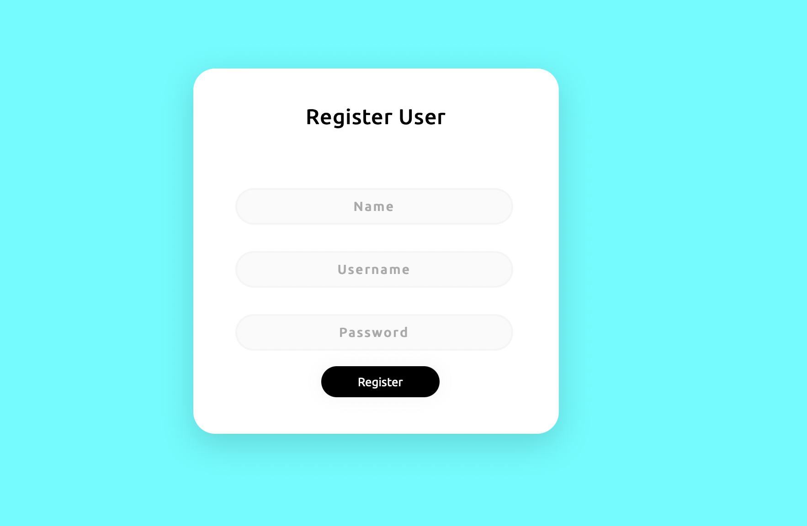
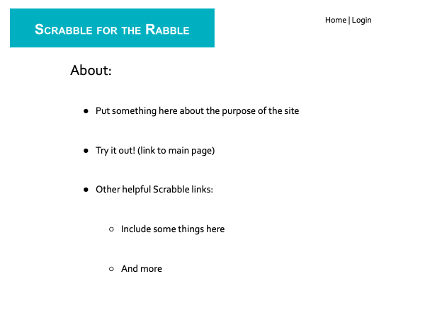
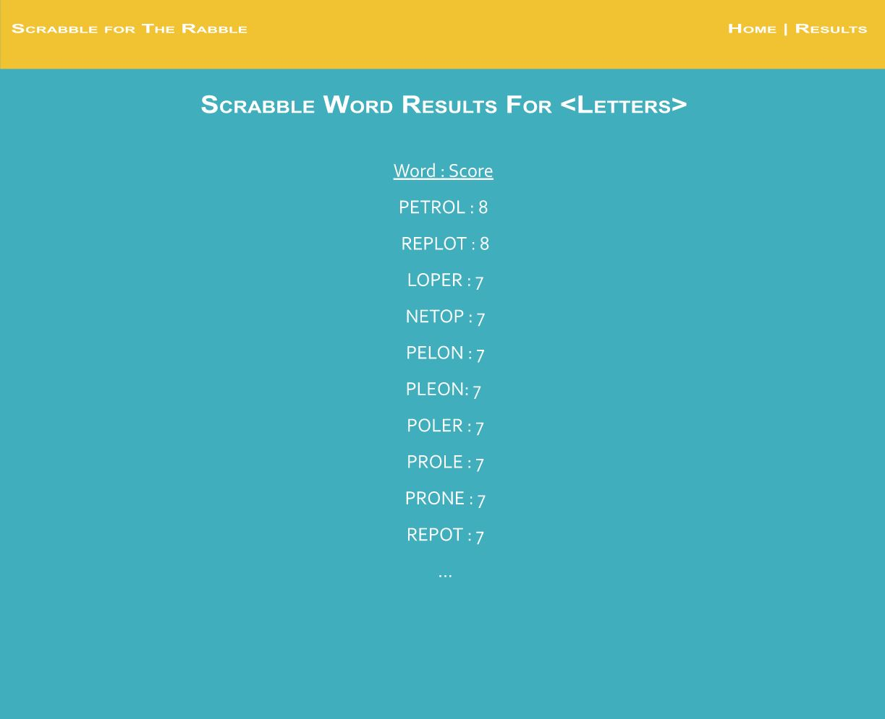
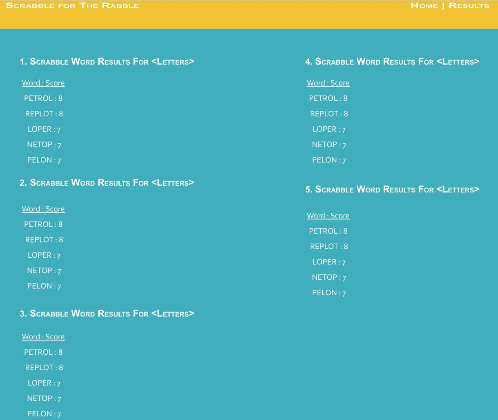

Page 1
  

__Title: Home / Search Page__

__Page Description:__ 

* Page displays a search box with optional filters to allow users to input their letters

__Parameters needed for the page:__ 

* User name/id can be used to query most recent searches to be shown in a drop-down menu from the search bar.

__Data needed to render the page:__  

* Need most recent searches for user, if logged in.

__Link destinations for the page:__

* About button takes user to About Page

* Login button takes user to Login / New Account Page

__List of tests for verifying the rendering of the page:__  

* Test search bar display most recent searches for user, in reverse chronological order

* Test check box for anagrams option can be checked/unchecked

* Test all linked destinations for page work correctly  

Page 2

__Title: Sign In Page__

__Page Description:__ 

* Page that a user will use to enter a username and password to login to the web app. 

__Parameters needed for the page:__ 

* Username and password will run against the database to see if it exists, it either is incorrect then it will return an error. It will also error if username and password does not exist. 

__Data needed to render the page:__  

* Username and password will be needed. 

__Link destinations for the page:__

* Link to Sign Up/Register page.

__List of tests for verifying the rendering of the page:__  

* Test to make sure that query to database is working. 

* Test to make sure it errors if username or password is incorrect

* Test to make sure error occurs is username does not exist in database. 

* Test link to Sign Up/Register Page. 

Page 3

__Title: Register Page__

__Page Description:__ 

* Page that a user will use to create a new user within the database by entering name, username, and password.

__Parameters needed for the page:__ 

* Once the new user is registered, then it will have to go back to the login page to login. 

* Username will not be able to be duplicated so an error will return if username is not available. 

__Data needed to render the page:__  

* Username, Name, and new password will be needed 

__Link destinations for the page:__

* Link to Sign in page so User can go back to Sign in 

* Link to home page if user wants to go back

__List of tests for verifying the rendering of the page:__  

* Test to make sure new user is created. 

* Test to make sure that duplicate username is not possible. 

* Test that username and password is stored correctly in database. 

* Test link back to login page and to home page. 

* Test that login works after new user is registered. 

Page 4

__Title: About Page__

__Page Description:__ 

* Page briefly describes the site's purpose, gives the user a means to try out the site, and offers links to other helpful Scrabble sites.

__Parameters needed for the page:__ 

* No specific parameters needed for this page

__Data needed to render the page:__  

* Description of project

* Other helpful Scrabble links

__Link destinations for the page:__

* Try It Out! button takes user to Home / Search Page

* Login button takes user to Login / New Account Page

* Additional helpful Scrabble links link to those sites

__List of tests for verifying the rendering of the page:__  

* Test all linked destinations for page work correctly

Page 5
  

__Title: Scrabble Results__

__Page Description:__ 

* Page displays the results of scrabble dictionary search from provided letters in descending scrabble score order  

__Parameters needed for the page:__  

* User letter input from search page

* Logged in username and credentials

__Data needed to render the page:__  

* Acceptable scrabble words and scores from dictionary search

* Scrabble words in descending score order

__Link destinations for the page:__

* Home button at top returns to main search page

* Results button at top moves to Past Results Page

* Scrabble For the Rabble button renders about page

__List of tests for verifying the rendering of the page:__  

* Test page displays last possible scrabble words from input

* Test page displays scrabble words in correct order

* Test all linked destinations for page work correctly  
  
  
  

Page 6
    

__Title: Scrabble Past Results__  

__Page Description:__  

* Page displays the top 5 scoring words from the last 5 word searches the user has submitted  

__Parameters needed for the page:__   

* Logged in username and credentials

__Data needed to render the page:__    

* User letter input from past 5 searches

* Top 5 words by Scrabble Score of past 5 Searches

* Scrabble words in descending scrabble score order 

__Link destinations for the page:__

* Home button at top returns to main search page

* Results button at top refreshes current past results page

* Scrabble For the Rabble button renders about page

__List of tests for verifying the rendering of the page:__  

* Test page displays last 5 searches for that user (or less if less than 5 searches)

* Test page displays top 5 scoring words for last 5 searches

* Test all linked destinations for page work correctly

