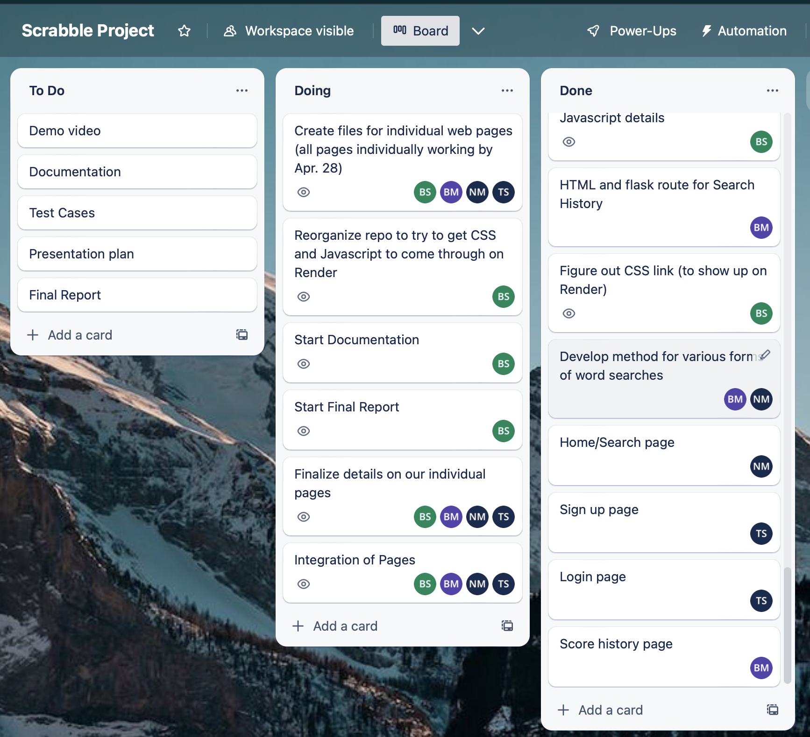
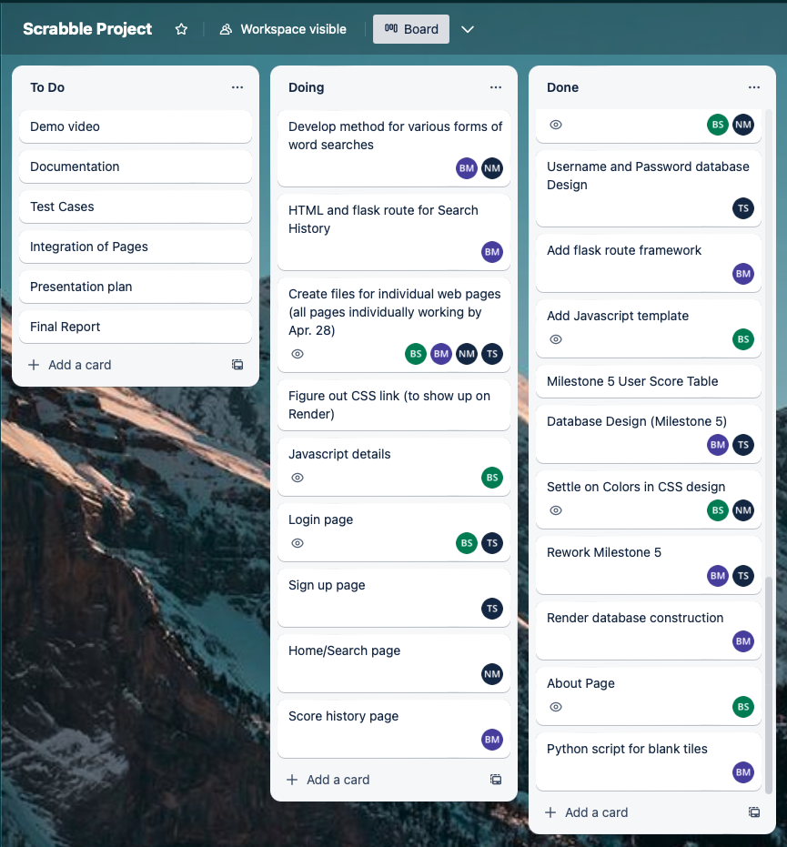
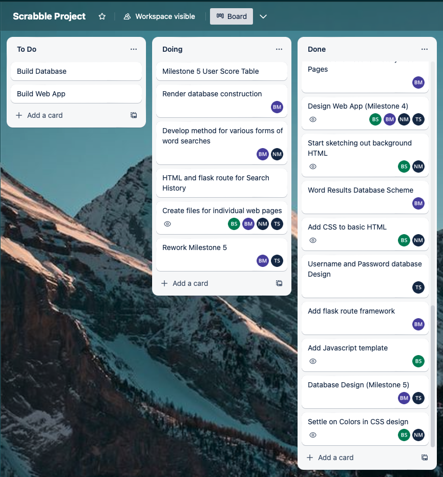
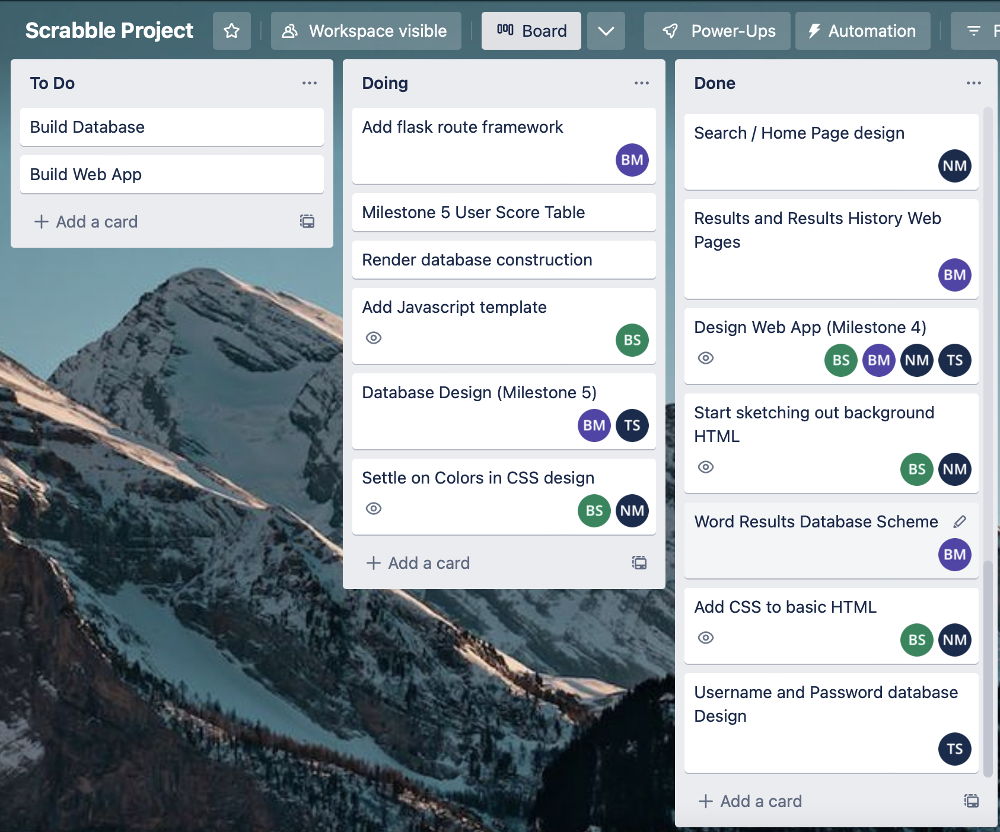
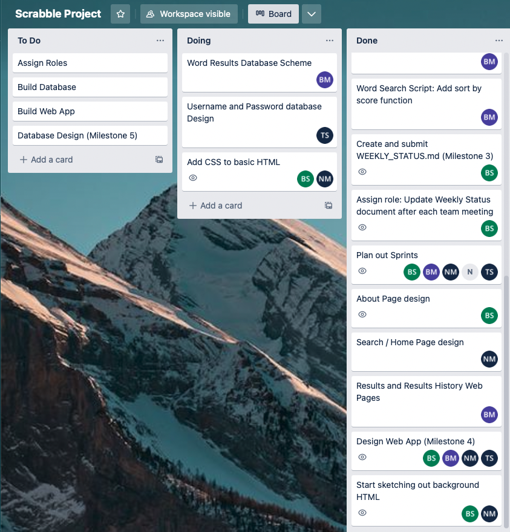
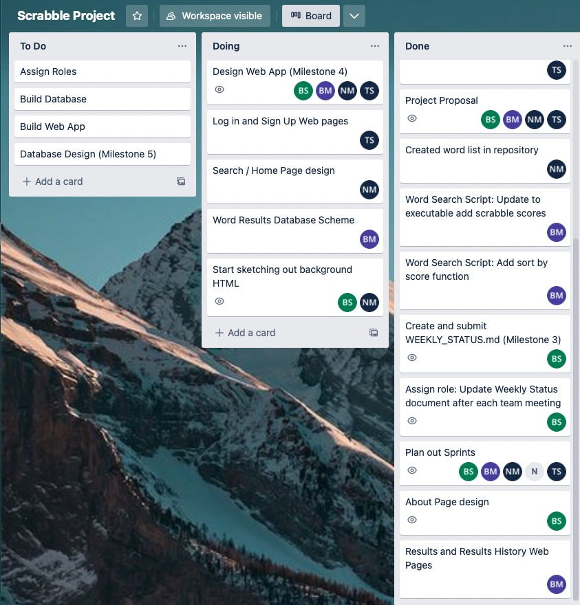
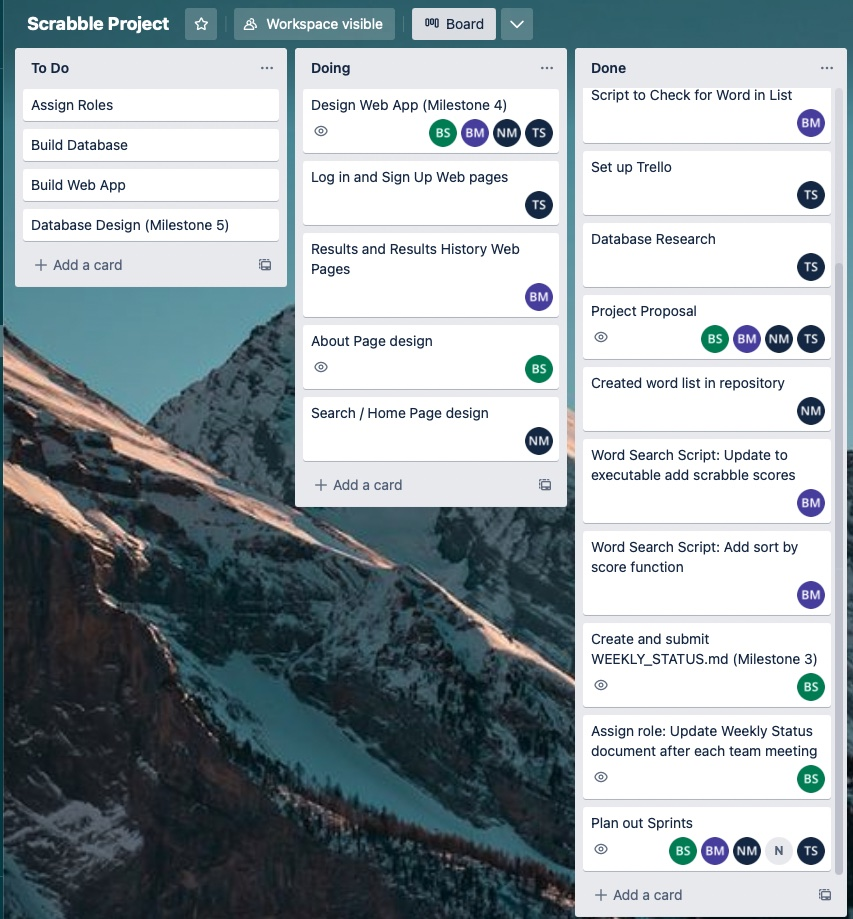
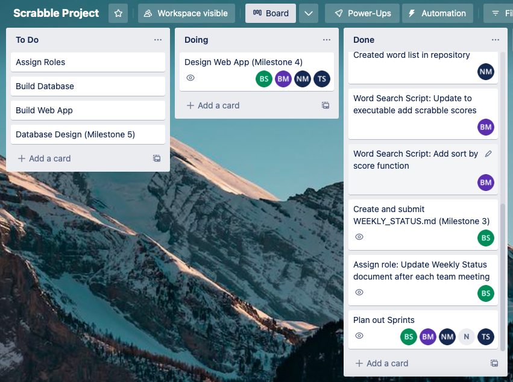
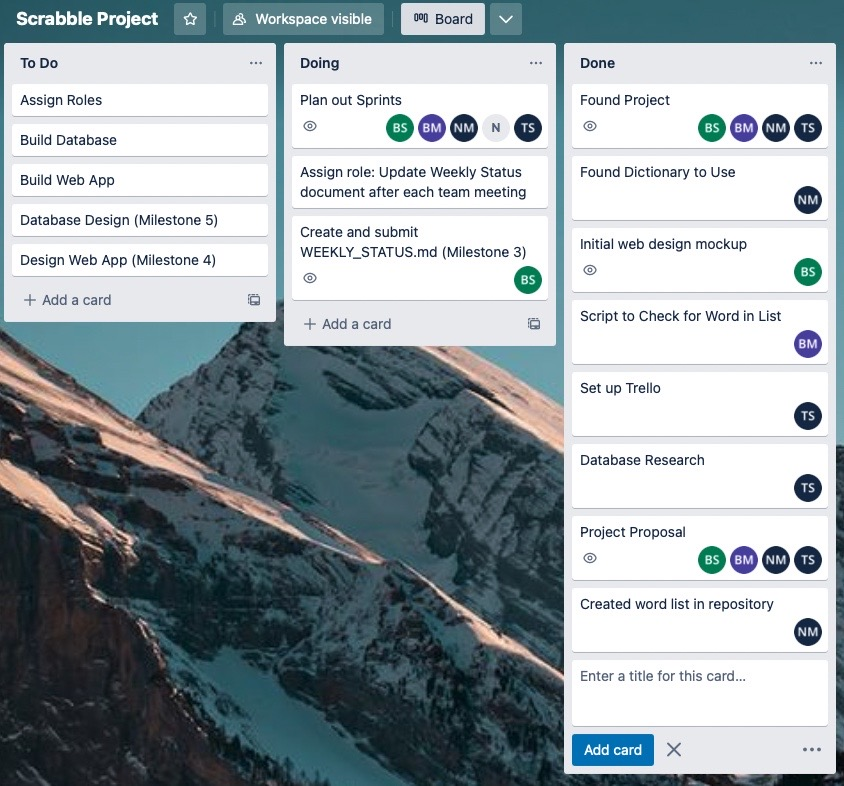

## Weekly Status
**Team 5**

Brenden McDonnell, Nathaniel Mutkus, Tyler Sanchez, Elizabeth Strickenburg
______________

Weekly Status as of 4/26/23:

*Currently:*

- Reorganizing repository to integrate CSS and JS
- Finalizing individual HTML pages
- Integrating individual pages together
- Beginning documentation and report

Weekly Status as of 4/19/23:

*Currently:*

- Implementation of web pages (Login, Sign Up, Search, Score History, Search History)
- Making sure web pages can appropriately draw from database and appear correctly on Render
- Javascript implementation

Weekly Status as of 4/13/23:

*Currently:*

- Reworking Milestone 5
- Creating files for our individual web pages
- Developing methods for word searches
- Creating Render database

Weekly Status as of 4/5/23:

*Currently:*

- Finishing Milestone 5
- Adding flask, Javascript template, and finalizing CSS

Weekly Status as of 3/22/23:

*Currently:*
- Working on database design for Word Results and Username/Password
- Adding CSS to sketched out HTML

Weekly Status as of 3/15/23:

*Currently:*
- Submitting final version of Milestone 4
- Beginning to work on database design
- Beginning to sketch out HTML

Weekly Status as of 3/8/23:

*Currently:*
- Working on designs and requirements for web pages.
- Will have designs uploaded by 3/14/23

Weekly Status as of 3/1/23:

*Currently:*
- Designing web pages for Milestone 4
- We planned out the basic pages and divided them between team members

Weekly Status as of 2/25/23: 

*Currently:*
- Planning out sprints
- Creating weekly status document for Milestone 3
- Assigning role for updating status document

